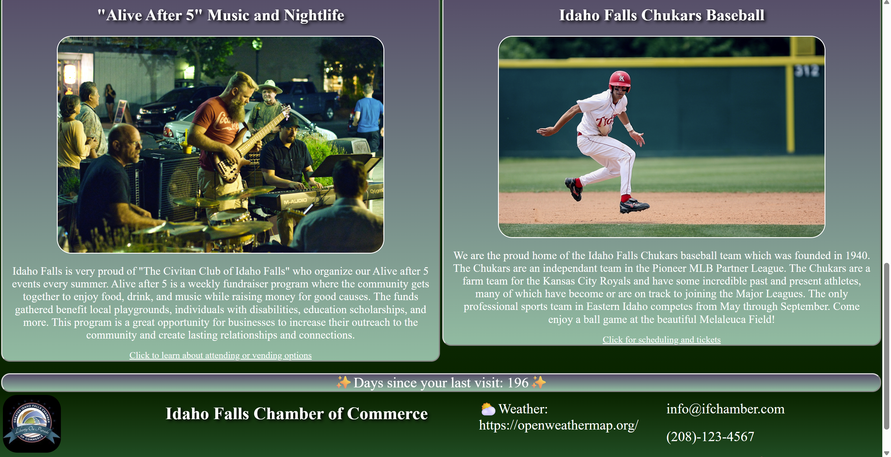

# 🌐 Chamber of Commerce Website  

## ✨ Overview  
This project is a fully responsive example website created for the **Idaho Falls Chamber of Commerce**.  
The site showcases modern **front-end web development practices**, including flexible layouts, navigation menus, and live updates.  

The design focuses on a **bright, welcoming theme** that reflects the community-oriented nature of a Chamber of Commerce.  

🔗 [View Live Website](https://jordan1819.github.io/Advanced-Web-Development/chamber/index.html)  

---

## 🛠️ Features  
- Responsive design that adapts across desktop, tablet, and mobile devices.  
- Dynamic navigation menus for smooth user experience.  
- Multiple pages structured to simulate a real Chamber of Commerce site.  
- Integration of live updates for dynamic content.  
- Clean, accessible layout with modern HTML, CSS, and JavaScript practices.  

---

## 💻 Tech Stack  
- **HTML5** – semantic structure and accessibility  
- **CSS3** – responsive design, custom styling, and flexible layouts  
- **JavaScript** – interactivity, dynamic updates, and DOM manipulation  

---

## 📱 Screenshots
### PC Browser View

### Mobile View with Expanded Hamburger Menu

---

## 📂 Project Goals  
- Demonstrate ability to design and build a responsive, multi-page website.  
- Practice structuring content for a real-world organization.  
- Apply modern front-end principles in layout, styling, and user interaction.  

---

## 🚀 About This Project  
This website was built as part of my **web development portfolio** to showcase front-end design and coding skills.  
It demonstrates both **technical ability** and **aesthetic design sense** in creating a site that could be adapted for a professional organization.  

---

## 📌 Links  
- 🔗 [Live Website](https://jordan1819.github.io/Advanced-Web-Development/chamber/index.html)  
- 🐙 [My GitHub Portfolio](https://github.com/Jordan1819)  
